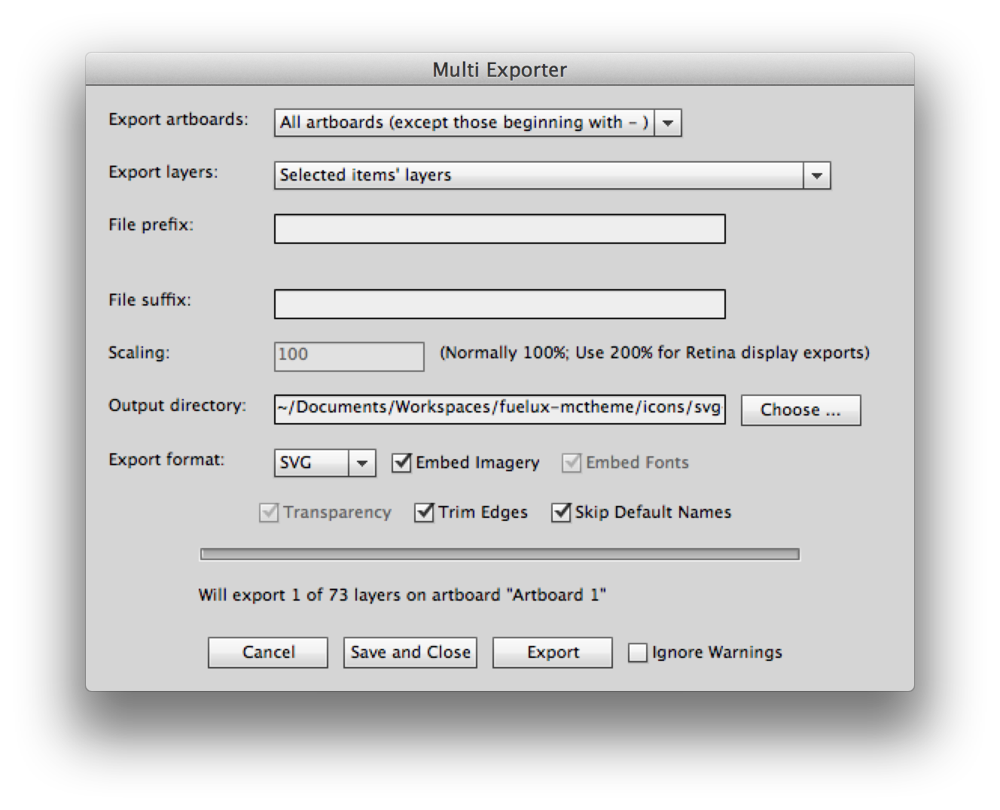

# Making Icons for the Marketing Cloud Theme

Starting at version 1.4 of the Marketing Cloud Theme, the icons used are being converted over to be SVG (Scalable Vector Graphics), rather than bitmap or font icons.

The icons are called in exactly the same way that the Glyphicons provided by Bootstrap (and thus, Fuel UX) are, so no additional work on a developer's part is required --- loading the Marketing Cloud Theme simply overrides the Glyphicons, where appropriate.

It ought be noted however that there *are* additional icons in the Marketing Cloud Theme that are not available in a standard Bootstrap or Fuel UX installation.

It should also be noted that, as of release 1.4, not *every* icon required by the Marketing Cloud Theme has been converted to SVG --- this is just the beginning!


## TL;DR

- Edit the included `fuelux-mctheme-icons-20px.ai` file
- Run the provided `MultiExporter-v2.jsx` script from within Illustrator to export .svg files
- Make the icons from the .svg files by running `$ grunt make-icons`. (Make sure you've modified a certain helper .js file in your grunticon node_module... see below)
- Create the CSS rules for the icons by running a Grunt task in the terminal: `$ grunt serve --force`
- See it in the browser: http://localhost:8000


## Overview of icon creation process

Care has been taken to make the creation and inclusion of the SVG icons into the Marketing Cloud Theme as automated a process as possible.

Provided in this project is an Illustrator file which contains the source art for all of the SVG icons. This file is considered canonical for the icons: any changes to existing icons, or creation of new ones, is to be done in this .ai file, rather than in the individual .svg files themselves.

In the Illustrator file each icon is on its own discreet layer with layer names ultimately controlling the name of the icons created.

Also provided in this project is a JavaScript file that is to be called from within Illustrator. This script programatically iterates through each layer in the Illustrator file, exporting the visible contents of individual layer in question to discreet .svg files.

A grunt process is then run that itself iterates over these exported .svg files, creating a stylesheet file that provides CSS rules, with the art being described as a background attribute with the image data as the URL.


## Source Art

The source file for the icons is located in the `fuelux-mctheme` project at:

    /icons/source-art/fuelux-mctheme-icons-20px.ai

Be sure to edit this file directly and *not* to copy it to another place. The point of putting it in the project is to keep it under version control!


## Installing the export script into Illustrator

Provided in this project is a JavaScript: `/icons/scripts/MultiExporter-v2.jsx`.

In order to Illustrator to properly export the layers as .svg files, this file must be copied into the proper "Scripts" directory in your Illustrator installation.

On a standard Mac OS X installation, that proper path would be:

	/Applications/Adobe Illustrator CS6/Presets/en_US/Scripts/MultiExporter-v2.jsx

Once this .jsx file is in the proper place, and you have the `fuelux-mctheme-icons-20px.ai` open, you can run the script via the menu at File > Scripts and choosing "MultiExporter-v2".


## Running the export script
Once you've chosen the script you will presented with a dialog box presenting you with several options for exporting.

Assuming you are exporting every icon, the options you wish to select are:

- Export Artboards: "All artboards (except those beginning with - )"
- Export Layers: "All layers as individual images (except those beginning with - )"
- Output directory: <choose the path to `icons/svg-exports/` in your `fuelux-mctheme` project>
- Export Format: "SVG". Also make sure the following checkboxes are checked: "Embed Imagery", "Trim Edges", "Skip Default Names"
- You may also wish to make sure "Ignore Warnings" is checked. The script can create several warnings that end up being meaningless, and each one of them must be dismissed manually. Subjecting yourself to this particularly obnoxious quirk of the script may well fall under the Geneva Conventions.





Once you've got the settings correct, click the "Export" button and go get yourself a cup of coffee --- it's going to be a while before it's done.


### It may be preferable to only export a single icon

Note that you do not always have to export every single icon!

There is an option in the script to export only the _selected items' layers_, and this will be much faster if you've only made a few changes, or added a few new ones, and thus are only exporting a few .svg files.

Just make sure to have the items you wish to export selected. ;)


### If you see a warning about "nyt_exporter_info"

You might see a warning that a layer named "nyt_exporter_info" failed to export --- this can safely be ignored.

The script stores its meta-data in this layer and mistakenly tries to export it sometimes. 

Do not hit "retry", your export probably worked just fine.


## Modifying Grunticon to generate an icon preview HTML file we can live with

As it is, the Grunticon node module does not allow us to make enough changes to its preview.hbs file to arrive at a preview we consider good enough. 

So we had to go in and modify some of Grunticon's code manually.

The file in question is at: `node_modules/grunt-grunticon/lib/grunticon-helper.js`.

The code you need to put into place is starts at about line 72, and you want this in there:

```javascript

		var prevData = {
			loaderText: min,
			embedText: embed,
			cssFiles: cssFiles,
			icons: icons,
			rows: []
		};


		var step = 6,
			i = 0,
			L = prevData.icons.length;
		for (; i < L; i += step) {
			prevData.rows.push({
				rowicons: prevData.icons.slice(i, i + step)
			});
		}
		;
```

We added the `rows: []` line to the var sets and the for-loop that pushes sliced up icons data into the `rows` array.

This allows us to generate a preview file that takes advantage of Bootstrap's grid system.


## Creating the CSS rules 

In the `fuelux-mctheme` project there is a `Gruntfile.js` which is used to create the SVG icons from the .svg files that live in the `icons/svg-exports/` directory.

You run the task "make-icons" itself:

	$ grunt make-icons

...but the the "make-icons" task is called when you run either the "dist" or the "serve" tasks.

	$ grunt dist

...or...

    $ grunt serve --force


When the "make-icons" task is called, each of the .svg files is gathered together and described in a .less file, and then some regular expressions are performed on the .less file ot transform the rules to match our needs better.


## Other Information

- The JavaScript used to export individual .svg files from Illustrator was originally found at: https://github.com/mericson/illustrator-scripts
- The Illustrator source art file was created with `-20px` in its name to allow for the eventuality that icons bigger than twenty pixels will be created. `¯\_(ツ)_/¯`
